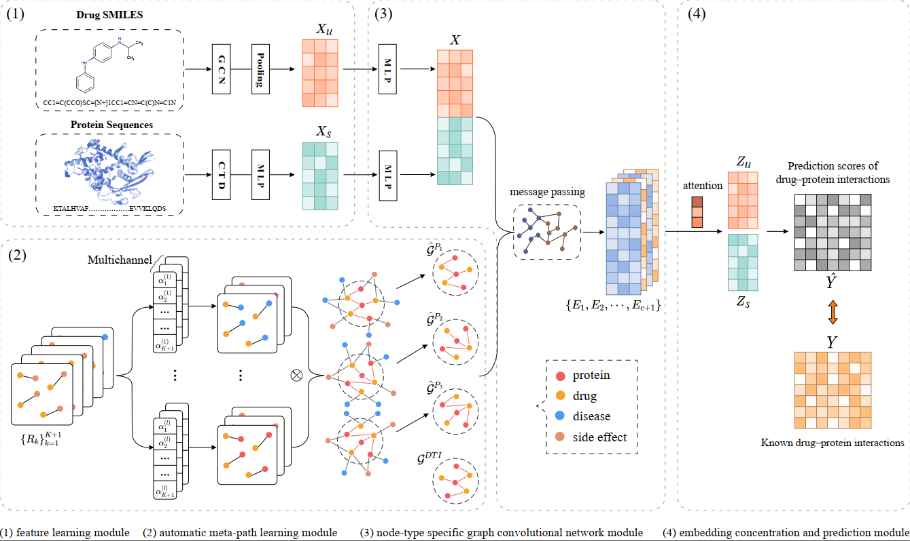

# HampDTI
This is the implementation of [A heterogeneous graph automatic meta-path learning method for drug-target interaction prediction](https://academic.oup.com/bib/article/23/4/bbac184/6596318)

# Requirements
- Pytorch 1.7.0
- Numpy 1.19.2
- Rdkit 2021.09.2
- pyG 2.0.2

# Quick start

To reproduce our results:  please run `main.py`. Options are:

`--num_channels: the number of channels, default: 4`

`--num_layers: the maximum length of the learned meta-paths, default: 3`

`--alpha: hyperparameter in loss function, default: 0.4`

`-t: select experimental data, default: 'o'`

#  Data description
`data` Folder. This folder contains the DTINet dataset.
-   drug.txt: list of drug names.
-   protein.txt: list of protein names.
-   disease.txt: list of disease names.
-   se.txt: list of side effect names.
-   drug_dict_map: a complete ID mapping between drug names and DrugBank ID.
-   protein_dict_map: a complete ID mapping between protein names and UniProt ID.
-   drug_se.npy : Drug-SideEffect association matrix.
-   protein_protein.npy : Protein-Protein interaction matrix.
-   drug_drug.npy : Drug-Drug interaction matrix.
-   protein_disease.npy : Protein-Disease association matrix.
-   drug_disease.npy : Drug-Disease association matrix.
-   protein_drug.npy : Protein-Drug interaction matrix.
-   drug_protein.npy : Drug-Protein interaction matrix.
-   drug_protein_indepent.npy :    the cross-validation set.
-   indepent_one_index.npy and indepent_zero_index.npy :    the independent test set.
-   drug_structure.pt :    drug structure features.
-   protein_structure.pt :    protein sequence features.
-   drug_protein_homo_protein_drug.txt: Drug-Protein interaction matrix, in which DTIs with similar drugs (i.e., drug chemical structure similarities > 0.6) or similar proteins (i.e., protein sequence similarities > 40%) were removed (see the paper).
-   mat_drug_protein_drug.txt: Drug-Protein interaction matrix, in which DTIs with drugs sharing similar drug interactions (i.e., Jaccard similarities > 0.6) were removed (see the paper).
-   mat_drug_protein_sideeffect.txt: Drug-Protein interaction matrix, in which DTIs with drugs sharing similar side effects (i.e., Jaccard similarities > 0.6) were removed (see the paper).
-   mat_drug_protein_disease.txt: Drug-Protein interaction matrix, in which DTIs with drugs or proteins sharing similar diseases (i.e., Jaccard similarities > 0.6) were removed (see the paper).
-   mat_drug_protein_unique: Drug-Protein interaction matrix, in which known unique and non-unique DTIs were labelled as 3 and 1, respectively, the corresponding unknown ones were labelled as 2 and 0 (see the paper for the definition of unique).

`drug_protein_feature` Folder

&emsp; Run `main.py` to learn drug structure features and protein sequence features.

- smlies.txt : drug smlies for all drugs in DTINet datasets.
- proteinSquence.txt : protein squences for all proteins in DTINet datasets.

# Contacts
If you have any questions or comments, please feel free to email wanghongzhun@webmail.hzau.edu.cn or wanghongzhunsix@qq.com
